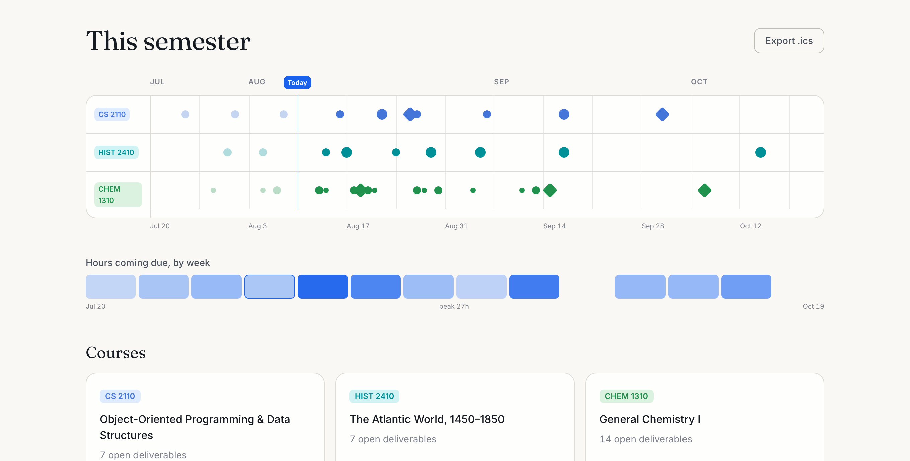

# Semester Autopilot

**GPS for your semester.** Drop in your syllabi — get every deadline on one
timeline, a grade-aware study plan, and a schedule that reroutes itself when
life happens.

**Live: [semester-autopilot.vercel.app](https://semester-autopilot.vercel.app)** ·
[Demo video](https://semester-autopilot.vercel.app) *(link lands with the
Devpost submission)* ·




Built solo for [ReverieHacks 2026](https://reverie-hacks-2026.devpost.com)
(Software Development track).

## Purpose & audience

Every semester, students hand-transcribe four to six syllabus PDFs into
calendars, miss buried deadlines anyway, and can't answer the only planning
questions that matter: *what should I work on today* and *what do I need on
the final?* Semester Autopilot is for any student (or anyone juggling
deadline-driven work) who wants those answers without spreadsheet
bookkeeping.

The design bet: **AI only where its mistakes are reviewable, deterministic
math everywhere it counts.**

## What it does

| | |
| --- | --- |
| **Ingest** | Upload a syllabus PDF, paste text, or import a public course page (Firecrawl). An LLM drafts deadlines, grading weights, and meeting times into a review table. It is *forbidden from inventing dates* — anything unclear ("Week of Nov 16", "TBD") arrives null-dated, low-confidence, with the verbatim source text shown. **You approve every row.** |
| **Semester view** | One timeline across courses — each deadline sized by its real share of your grade, exams as diamonds, a today line, and a workload heatmap of the heavy weeks. |
| **Calendar export** | One click to `.ics`. All-day events, RFC 5545-correct escaping/folding, zero timezone data by design — imports cleanly into Google and Apple Calendar. |
| **Autopilot planner** | Set weekly study hours; a deterministic engine spreads the work by grade weight and urgency with per-day caps and release windows. Tap **"I'm busy"** on any day and the plan visibly reroutes — and when something genuinely no longer fits, it says so in plain language. |
| **Grade what-if** | "What do I need on the final for a 90?" — weight-aware projections, skip-impact costs, already-secured / out-of-reach states. |
| **Local-first** | No account, no database. Your data lives in your browser (JSON export/import for backup) and self-heals if the stored blob is ever corrupted. |


## Quickstart

```bash
pnpm install
cp .env.example .env.local   # optional — see below
pnpm dev
```

Runs at http://localhost:3000. With no keys at all, set `LLM_MOCK=1` for
fixture extraction — everything except live LLM calls works offline. Or run
**fully offline with a real local model** via Ollama:

```bash
ollama pull llama3.1:8b
printf 'FROM llama3.1:8b\nPARAMETER num_ctx 16384\nPARAMETER temperature 0\n' > Modelfile
ollama create autopilot-llama -f Modelfile && rm Modelfile
```

`.env.local`:

```ini
LLM_BASE_URL=http://127.0.0.1:11434/v1   # 127.0.0.1, not localhost (IPv6 pitfall)
LLM_API_KEY=ollama
LLM_MODEL_ID=autopilot-llama
LLM_STRUCTURED=1                          # schema-constrained decoding
```

### Configuration reference

| Variable | Purpose |
| --- | --- |
| `LLM_BASE_URL` | Any OpenAI-compatible endpoint (Featherless, Ollama, …) |
| `LLM_API_KEY` | Key for that endpoint |
| `LLM_MODEL_ID` | Model id (e.g. `meta-llama/Meta-Llama-3.1-70B-Instruct`) |
| `LLM_STRUCTURED` | `1` = `json_schema` constrained outputs (on for Ollama) |
| `FIRECRAWL_API_KEY` | Course-page URL import (optional) |
| `LLM_MOCK` | `1` = fixture extraction, no network (e2e/offline dev) |

### Scripts

```bash
pnpm test        # 514 unit tests — run twice (America/Chicago + Pacific/Kiritimati)
pnpm e2e         # 18 Playwright specs × chromium/firefox/webkit, incl. axe a11y gate
pnpm coverage    # v8 coverage (scheduler: 100% lines)
pnpm typecheck   # next typegen + tsc
pnpm build       # production build
```

## How it's built

- **Next.js 16** (App Router) · TypeScript · Tailwind v4 · deployed on Vercel
- **Extraction**: Vercel AI SDK `generateObject` + zod against any
  OpenAI-compatible endpoint; per-row confidence + verbatim date text; one
  repair retry, then honest failure with a manual path
- **Scheduler**: pure TypeScript, integer half-hours, urgency × grade-weight
  greedy fill — deterministic to the byte, fuzz-tested across 100 random
  semesters and two timezones
- **State**: zustand + localStorage (`skipHydration` + a hydration gate), no
  server state at all — the API surface is exactly two routes
- Full architecture notes: **[docs/ARCHITECTURE.md](docs/ARCHITECTURE.md)** ·
  User manual: **[docs/USER-GUIDE.md](docs/USER-GUIDE.md)**

## Quality bar

- **514 unit tests** in a two-timezone matrix (a calendar app that fails at
  UTC+14 fails, period) — scheduler at 100% line coverage with invariant
  fuzzing (capacity, windows, hour conservation, determinism)
- **54 E2E runs** (18 specs × 3 browsers) against production builds,
  including corrupt-storage recovery and a **zero-critical/serious axe
  accessibility gate** on six surfaces
- WCAG AA contrast enforced at the design-token level; keyboard-operable;
  `prefers-reduced-motion` respected end to end
- CI runs lint → typecheck → unit → E2E on every push

## Sustainability

Free to run forever: no servers beyond static hosting + two stateless
routes, no database, and the AI layer speaks to **any OpenAI-compatible
model — including a free local one via Ollama, fully offline**. MIT
licensed. Roadmap-ready seams: share links, multi-semester archives, iCal
subscription feeds, and PWA offline packaging are all additive.

## Honest limitations

- Scanned (image-only) PDFs are detected and refused with guidance — no OCR yet.
- Course pages behind logins (Canvas, Blackboard) can't be scraped; paste instead.
- Effort estimates start as type-based defaults — visible, editable, never
  presented as more than estimates.

## AI assistance disclosure

The extraction feature uses an LLM at runtime (see above — reviewable by
design). The codebase itself was built with AI pair-programming assistance
(Claude); every line is reviewed, typed, linted, and covered by the test
suite described above.

## License

[MIT](./LICENSE) © 2026 Sebastien Henry
