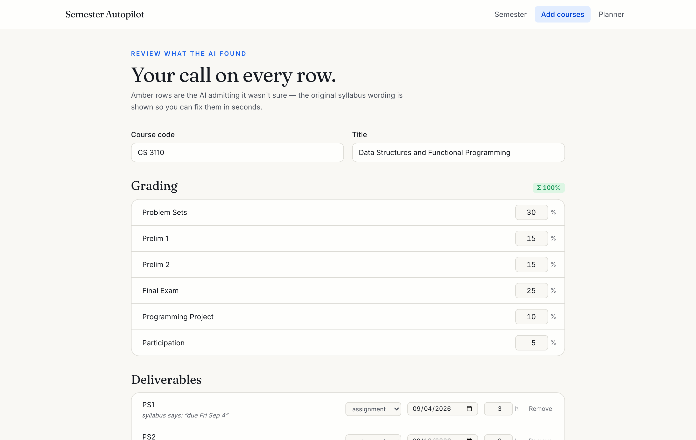
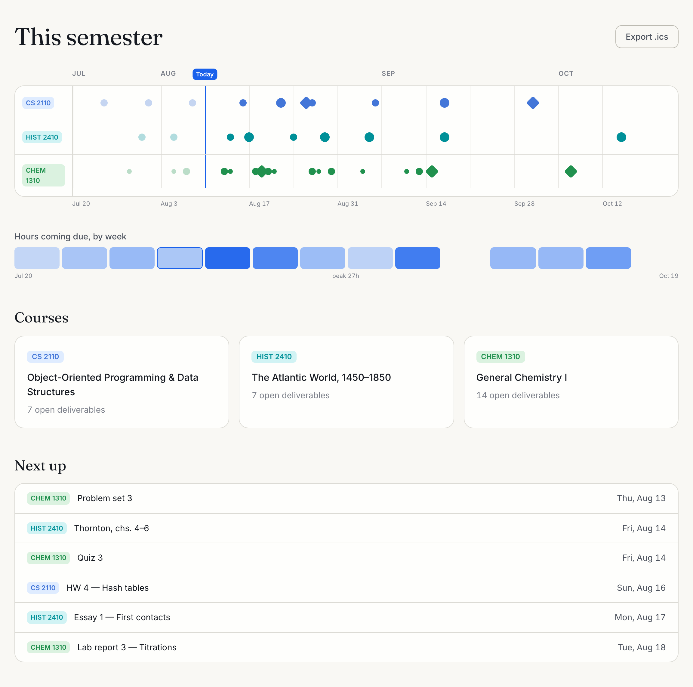
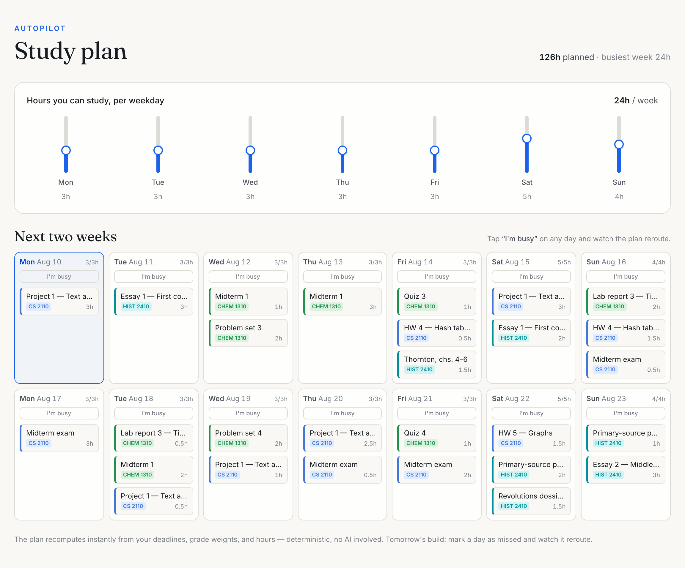
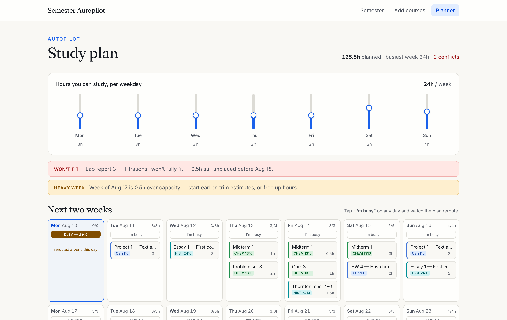

# User guide

Semester Autopilot needs no account and stores everything in your browser.
The fastest tour: open the app and press **Try with demo data** — a full
three-course semester appears, positioned relative to today.

## 1 · Add your courses

**Add courses** offers three paths:

- **Drop a PDF** — your syllabus, as long as it has real text (a scanned
  image PDF is detected and politely refused; paste the text instead).
- **Paste text** — any portion of the syllabus; the grading and schedule
  sections are what matter.
- **From a link** — a *public* course page URL. Pages behind logins
  (Canvas, Blackboard) can't be read; paste instead.

The AI drafts what it finds. **Nothing is saved yet** — you land on the
review table first:

- Amber rows are the AI admitting it wasn't sure. The verbatim syllabus
  wording ("Week of Nov 16", "TBD") is shown beside them.
- Rows without a date sit in **"needs a date"** — give them one and they
  join the semester; leave them and they're simply omitted.
- Fix anything inline (title, type, date, hours, weights), then **Add to
  semester**.

## 2 · Read your semester

- Each course is a lane; each dot is a deliverable **sized by how much it
  moves your grade**; diamonds are exams. Hover for details.
- The heatmap below shows hours coming due per week — heavy weeks glow.
- **Export .ics** downloads every deadline as all-day calendar events that
  import cleanly into Google/Apple Calendar.

Click a course card to open it: mark items done, record scores, tune hour
estimates, or remove the course.

## 3 · Let Autopilot plan

Set the hours you can realistically study per weekday. The engine spreads
your work automatically — heavier-weighted, closer deadlines first, capped
per day so nothing is crammed.

**Life happens?** Tap **"I'm busy"** on any day:

The day empties, the work reflows around it, changed days pulse — and if
something genuinely no longer fits, a plain-language conflict appears
(*"Quiz 3 won't fully fit — 1h still unplaced before Aug 14"*). Autopilot
never silently overbooks you. Tap **busy — undo** to restore.

## 4 · Ask "what if?"

On any course page, **Grade outlook** shows your current and projected
grade, and answers the classic question against your chosen target:
*"You need 87 on Final exam."* Drag the what-if sliders to see futures;
each slider also shows what skipping that item costs.

Projections assume unscored work continues at your current average — the
assumption is printed right on the panel.

## 5 · Your data

- Everything lives in this browser's storage. No account, no server copy.
- Corrupted storage self-heals to a clean state rather than breaking the app.
- Demo data refreshes itself when we ship improvements to it.

## Troubleshooting

| Symptom | Cause & fix |
| --- | --- |
| "This PDF looks scanned" | No text layer — copy the text from the original and paste it. |
| "Link import isn't configured" / "AI extraction isn't configured" | That deployment has no Firecrawl/LLM key. Paste text instead, or self-host with your own keys (see README). |
| "Couldn't read that page" | The page needs a login or blocks robots — paste the text. |
| Extraction got a date wrong | That's what the review table is for — fix the row before committing; low-confidence rows show the original wording. |
| A day shows "no study hours" | That weekday's slider is at 0 in the planner. |
